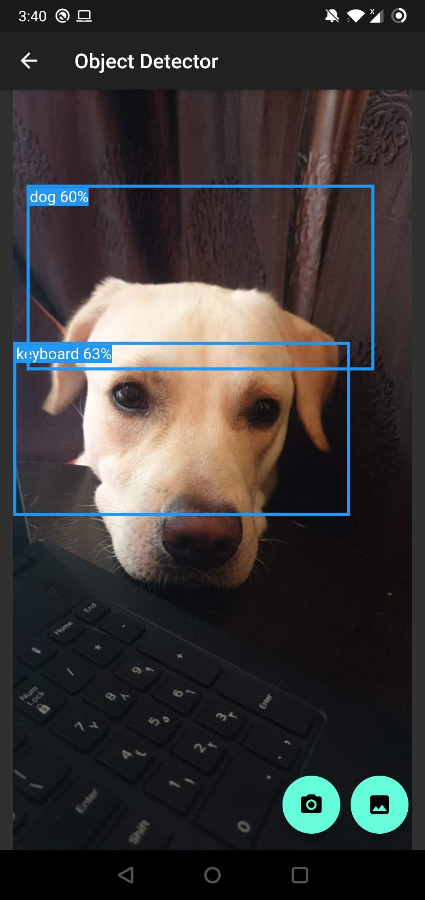
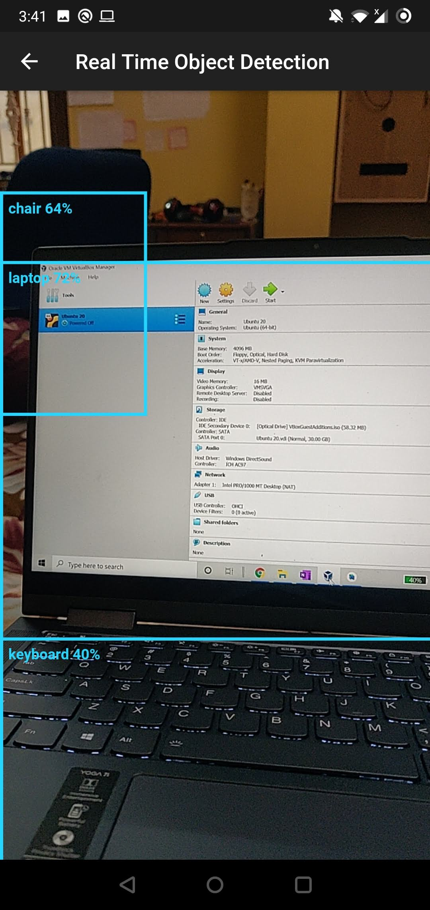

# Object Detection
## Android Application using Machine Learning
This application can detect objects in two ways:
  * Image choosen from Gallery
  * Real time in video stream
  
Image from Gallery           | Real Time Detection
:-------------------------:|:-------------------------:
 |      

